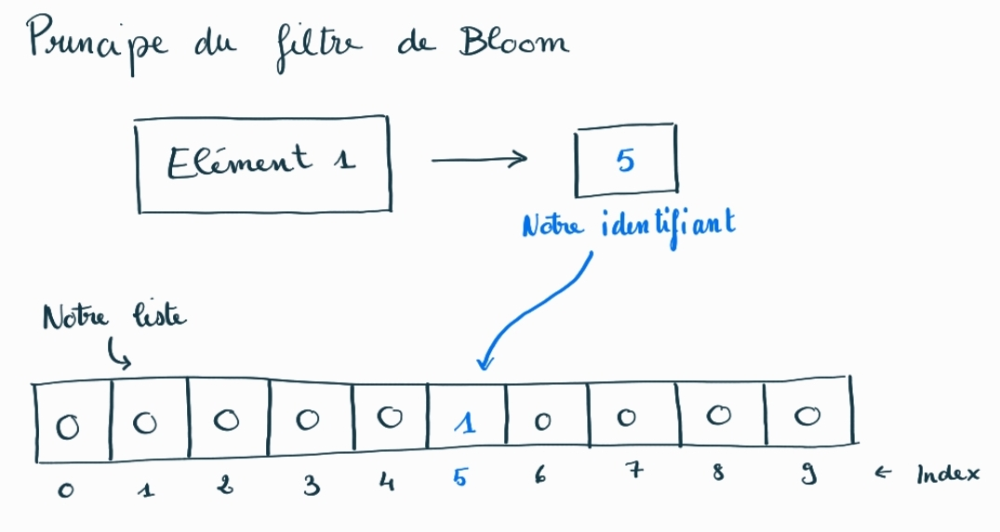
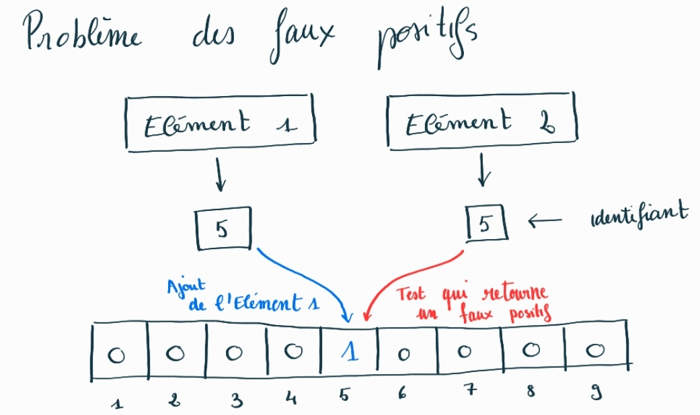
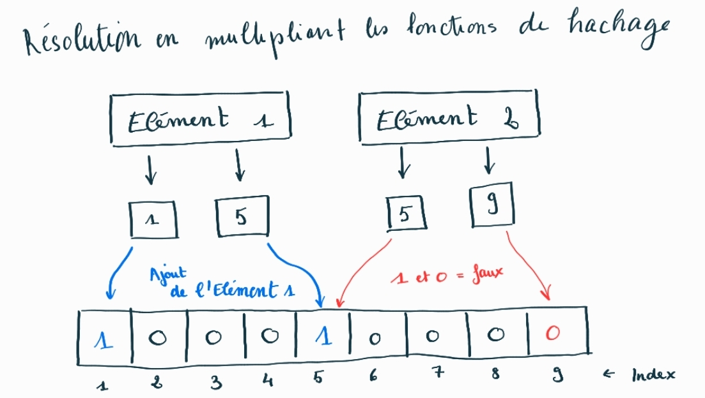
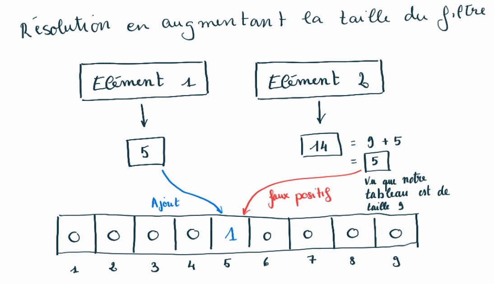
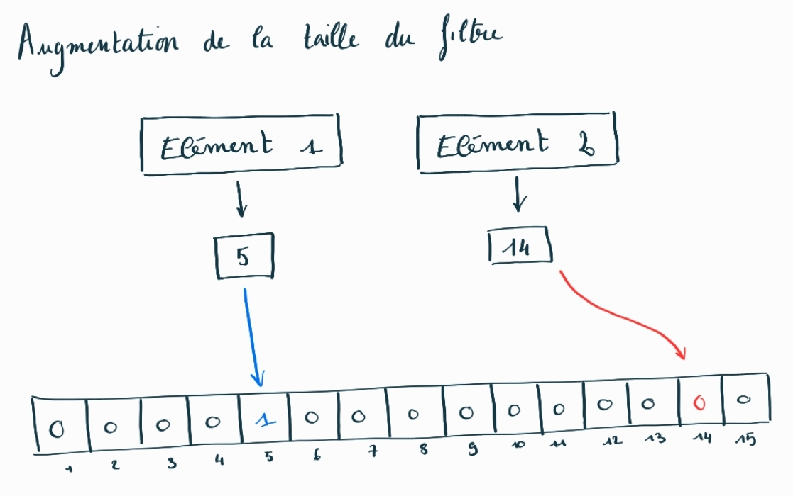
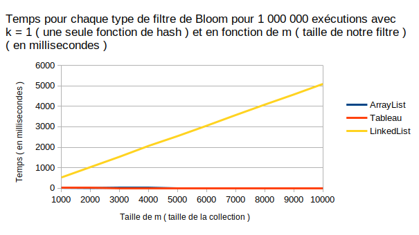
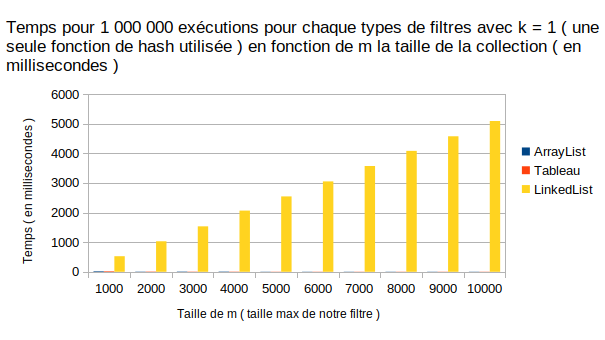
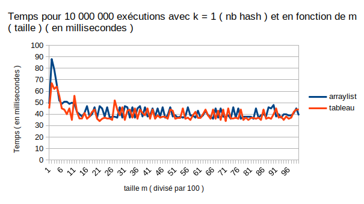
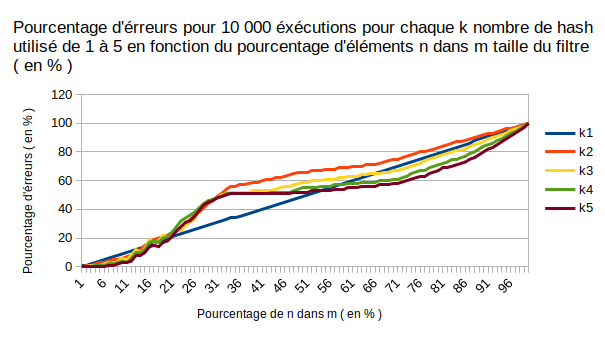
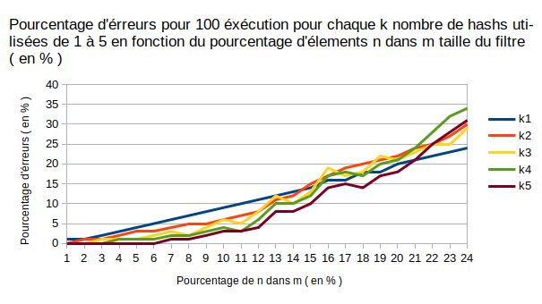

# Projet Filtre de Bloom

# Sommaire

* [Introduction](#introduction)
  * [Objectifs](#objectif)
  * [Modalités](#modalités)
  * [Glossaire](#glossaire)
* [Principe du Filtre de Bloom](#principe-du-filtre-de-bloom)
    * [Définition](#définition)
    * [Avantage](#avantage)
    * [Désavantages](#désavantages)
* [Implémentation](#implémentation)
    * [Principe](#principe)
    * [UML](#uml)
    * [HashCode](#hashcode)
* [Benchmark](#benchmark)
    * [Comparaison des temps d'exécution](#comparaison-des-temps-d'exécution)
        * [Démarches](#démarches)
        * [Résultats](#résultats)
        * [Interprétation](#interprétation)
        * [Conclusion](#conclusion)
    * [Analyse du taux d'erreur](#analyse-du-taux-d'erreur)
        * [Démarches](#démarches2)
        * [Résultats](#résultats2)
        * [Interprétation](#interprétation2)
        * [Conclusion](#conclusion2)
* [Conclusion Finale](#conclusion-finale)

<h1 id="introduction">Introduction</h1>

<h2 id="objectif">Objectifs</h2>

L'objectif de ce projet est d'implémenter un Bloom Filter avec Netbeans, avec comme tableau de booléen des ArrayList, des listes simples et des LinkedList.

Pour ensuite tester quel est le plus rapide puis ensuite chercher la meilleure implémentation à faire selon le nombre de fonctions de hachage et la taille du tableau de booléen pour avoir le moins possible d'erreurs.

<h2 id="modalités">Modalités</h2>

Ce projet est dans le cadre du cours de Développement Efficace de l'IUT de Bordeaux, département informatique.

Nous avions 2 mois pour réaliser ce projet, pour le rendre le 18 décembre 2022.

La seule contrainte était d'utiliser Netbeans.

Le résultat à fournir est le code produit du filtre, son benchmark et le rapport pour expliquer nos démarches et comment on a fait ce projet.

<h2 id="glossaire">Glossaire</h2>

Benchmark :Ensemble d'actions qui  aident à comparer les performances et les pratiques entre différents services ou produits.

UML : Le Langage de Modélisation Unifié, de l'anglais Unified Modeling Language, est un langage de modélisation graphique à base de pictogrammes conçu comme une méthode normalisée de visualisation dans les domaines du développement logiciel et en conception orientée objet.

<h1 id="principe-du-filtre-de-bloom">Principe du Filtre de Bloom</h1>

<h2 id="définition">Définition</h2>

Le Filtre de Bloom est un principe qui sert à savoir efficacement si un élément est dans un tableau le plus rapidement possible. Effectivement, sans ce principe, si on veut savoir si on a un élément dans une liste, on est obligés de parcourir tout notre tableau si l'élément n'y est pas ou en partie si on le trouve avant la fin, or ce n'est pas très rapide.

Le principe du filtre de Bloom permet donc d'associer un nombre unique tel un identifiant à notre élément et d’aller voir ensuite directement dans notre liste initialement remplis avec que des 0 à l'endroit de l'identifiant si on a un 1 ( vrai ) ou un 0 ( faux ), si on a un 1 on pourra dire que l'élément est possiblement contenu dans le filtre sinon si on a un 0 on pourra assurer que l'élément n'est pas contenu.

Pour entrer un élément dans le filtre, c'est tout aussi simple, on calcule l'identifiant de notre élément et on met un 1 à l'index du numéro de notre identifiant.



<h2 id="avantage">Avantage</h2>

Rapidité : on peut donc savoir très rapidement si un élément n'est pas de notre liste, car on n’est pas obligé de parcourir toute notre liste d'éléments.

<h2 id="désavantages">Désavantages</h2>

Les faux positifs : Le problème majeur que l'on a, c'est qu'il est possible que 2 éléments différents aient le même identifiant dans le filtre, du coup si on a ajouté préalablement l'élément 1 à notre filtre, puis que l'on veut savoir si notre élément 2 est contenu dans notre filtre, notre filtre nous répondra que oui.

Pour régler ce problème on peut donc soit mettre plusieurs identifiants à notre filtre ou augmenter la taille de notre filtre.









Impossibilité de retirer un élément : on ne peut pas retirer un élément du filtre à cause justement du fait que 2 éléments peuvent avoir le même identifiant du coup si on ajoute les 2 dans notre filtre, si on veut par la suite en enlever 1 cela enlèverait forcément les 2.

Impossibilité de récupérer un élément : on ne peut pas récupérer un élément dans la liste, cette liste ne sert qu'à vérifier si un élément n'est pas contenu dans notre filtre.

<h1 id="implémentation">Implémentation</h1>

<h2 id="principe">Principe</h2>

Le filtre de Bloom fonctionne avec une liste de bits (ici, c'est une liste de booléens), la liste est donc initialisée à FALSE et une ou plusieurs fonctions de hachages qui nous sert à avoir les identifiants.

Lorsque nous voulons ajouter un objet, nous prenons le hashcode ou les hashcode de cet objet et utilisons les hashs comme des index dans la liste et nous mettons la valeur de ses index à TRUE.

Ainsi, lorsque nous voulons savoir si un objet est dans la liste, nous prenons son ou ses hashs et nous vérifions si les valeurs des index sont toutes à TRUE.

Si toutes nos valeurs sont a TRUE, l'objet est peut-être dans la liste, mais si on a au moins une valeur à FALSE alors on peut affirmer que l'objet n'est pas dans le filtre.

<h2 id="uml">UML</h2>

.png)

<h2 id="hashcode">HashCode</h2>

J'ai choisi de faire des méthodes hash simples, mes méthodes de hachages sont très simples et utilisent la méthode hashcode() de java, elle marche donc avec tous les objets.

Vu que j'ai testé mes benchmark avec des Intégrer, la méthode hashcode de Java retourne la valeur de l'Integer comme hashcode, pour créer d'autres méthodes de hash j'ai donc ajouté un nombre à ce hash et je l'ai multiplier par un autre nombre puis j'ai pris le reste de la division par la taille de notre filtre.

Pour le choix des nombres ajouté et multiplié, j’ai choisie au hasard, mais j’ai préférablement dans la majorité choisit des nombres premiers, aussi je n’ai pas généré aléatoirements ses nombres pour chacun de mes filtres car je voulais que tous soit pareil quand je ferai mon benchmark, comme ça, cela ne fausse pas mes résultats.

Voici la liste de mes méthodes de hashcode :

```java
    public int hash0(Object o){
        return o.hashCode()%this.tailleTab;
    }

    public int hash1(Object o){
        return abs((o.hashCode()+1)*3%this.tailleTab);
    }

    public int hash2(Object o){
        return abs((o.hashCode()+33)*7%this.tailleTab);
    }
    
    public int hash3(Object o){
        return abs((o.hashCode()+11*13)%this.tailleTab);
    }
    
    public int hash4(Object o){
        return abs((o.hashCode()+17)*17%this.tailleTab);
    }  
```

<h2 id="benchmark">Benchmark</h2>

Pour faire les benchmarks du filtre de Bloom, j'ai décidé de générer des fichiers CSV avec les valeurs obtenues, pour ensuite pouvoir générer des graphiques simplement avec Excel.

Pour chaque valeur obtenue, j'ai à chaque fois fait 10 000 exécutions ou 1 000 000 pour avoir des valeurs qui essaient de tendre au plus vers la réalité.

<h2 id="comparaison-des-temps-d'exécution">Comparaison des temps d'exécution</h2>

<h3 id="démarches">Démarches</h3>

Pour regarder les performances du temps, j'ai choisi d'observer le temps que met chaque filtres ( ArrayList,  tableau, LinkedList ) pour voir s'il contient un élément ou non, car c’est ça que sert notre filtre principalement.

Chaque filtre est testé avec le même banc de test de chiffres aléatoires compris entre 0 et la taille de mes filtres pour ne pas fausser les résultats.

J’ai choisi une taille de filtre de 10 000 et seulement une fonction de hash pour ne pas à avoir à attendre trop longtemps pour produire les valeurs.

J'ai d’ailleurs aussi fait le choix de mettre 5 000 éléments dans mon filtre pour avoir statistiquement 50% de chiffres compris dans le filtre et 50% de non compris dans le filtre.

Le principe de mon benchmark est donc de récupérer le temps t0 à l'instant actuel, puis effectuer mes 10 000  exécutions, puis récupérer t1 le temps après cela, le résultat retourné est donc t1-t0 en millisecondes.

<h3 id="résultats">Résultats</h3>





<h3 id="interprétation">Interprétation</h3>

On peut donc observer que la LinkedList est largement au dessus de l’ArrayList et de la liste simples, cela est dû au fait que pour récupérer la valeur à l'indice i la LinkedList est obligés de parcourir tous les éléments de 0 à i, alors que pour les deux autres peuvent directement accéder à la valeur sans parcourir tous les éléments précédents.

Sur ses graphiques, les courbes de l’ArrayList et de la liste simple se confondent, j'ai donc décidé de faire un graphique seulement avec ses deux filtres, voici donc ce graphique :



On peut donc voir que c'est quand même assez équivalent dans les deux cas avec un petit peu plus de rapidité du côté de la liste simple.

En revanche, je ne saurais pas expliquer le fait qu’on a un pique plus grand de temps au début de notre courbe, je pense peut être que c’est java qui est obligé de se mettre en route au début et donc qui met un peu plus de temps, mais ce n’est qu’une supposition.

<h3 id="conclusion">Conclusion</h3>

Pour effectuer un filtre de Bloom le plus rapide, il est donc préférable de choisir comme type de liste de booléens, la liste simple.

<h2 id="analyse-du-taux-d'erreur">Analyse du taux d'erreur</h2>

<h3 id="démarches2">Démarches</h3>

Pour regarder quel paramétrage du filtre permet d'avoir le moins de faux positifs, j’ai regardé pour tous les nombres de possibles de méthodes de hachage de 1 à 5, le nombre en pourcentage de faux positifs sur un filtre de taille 10 000, en changement le nombre d'éléments ajouté dans le filtre de 0 jusqu'à ce que mon nombre d'éléments soit égale à la taille de mon filtre.

Pour cela, j'ai un unique banc de test de nombres positifs aléatoires non ajouté dans mon filtre, pour essayer de ne pas fausser les résultats.

Aussi, quand je rajoute plusieurs éléments dans mon filtre, tous ses éléments sont différents, car pour n le nombre d'éléments ajoutés, mes nombres sont les nombres de 0 à n, pour avoir à peu près les mêmes éléments composants chacun de mes filtres.

Pour finir pour ce benchmark, j'ai choisi d'utiliser l'ArrayList car c'est assez rapide pour faire des grands bancs de tests, j'aurais pu aussi choisir la liste simple, car c'est la plus rapide, mais j'ai fait le benchmark sur les faux positifs avant ceux sur le temps d'exécution, en tout cas cela ne change rien sur les résultats obtenus.

<h3 id="résultats2">Résultats</h3>





<h3 id="interprétation2">Interprétation</h3>

On peut donc observer de ce graphique qu'avec un nombre d'éléments n, tel que n’est compris entre 0% et environ 21% de m la taille du filtre, la meilleure implémentation est avec 5 fonctions de hachages.

C'est dû au fait que si on multiplie le nombre de hash on réduit la probabilité qu'un élément a des hashs qui on déjà était mis à VRAI dans notre filtre.

Cela est dû possiblement aussi à notre filtre qui ne sera pas encore plein, pour mieux visualiser si chaque l'élément ajouter à 5 hash ( on suppose différents ), l'élément prend donc 5 places dans notre filtre, si par exemple, on a un filtre de taille 100, on calcule 100/5=20, on peut déterminer donc que pour remplir notre filtre, il faut 20 éléments ( donc n 20% de m d'où le ~21% ), au-delà notre filtre sera potentiellement remplis majoritairement de valeur VRAI, ce qui causera de multiples faux positifs.

Ensuite, avec n compris entre 21% et 54% de m, il est préférable de n'utiliser qu'une seule fonction de hachage, pour contrer ce problème possiblement de filtre saturé par majoritairement des VRAI.

Puis enfin, de 54% à 100%, il est préférable d'utiliser de nouveau 5 fonctions de hachage.

On peut supposer que cela est dû au fait que notre filtre doit être maintenant saturé de 50% de VRAI avec seulement une seule fonction de hachage donc on a normalement comme le montre notre graphique environ 50% d'erreurs, pour contrer cela, on doit donc utiliser plus de fonctions de hachages.

Ce résultat m’étonne un peu pour n de 54% à 100% de m, je ne sais à vrai dire pas trop comment l’expliquer.

On peut aussi observer que quand un filtre avec minimum 2 fonctions de hachage atteint les 50% d'erreurs le nombre d'erreurs ralenti par la suite, alors qu'un filtre de Bloom avec seulement une fonction de hachage à une courbe plutôt linéaire.

<h3 id="conclusion2">Conclusion</h3>

Pour conclure ce benchmark, il faut choisir son nombre de méthodes de hachage selon le nombre d'éléments qui va être inséré par la suite dans le filtre.

Tableau des réponses :

|Pour n % de m|Nombre de fonction de hash|
|:-:|:-:|
|0% - 21%|5|
|21% - 54%|1|
|54%-100%|5|

Aussi, on peut penser que si on n'était pas limité par la taille de notre filtre, la meilleure solution serait à chaque fois le nombre de fonctions de hachages le plus élevé, pour contrer les problèmes des éléments avec les mêmes hashs.

<h1 id="conclusion-finale">Conclusion Finale</h1>

Pour conclure, on peut dire que pour créer un filtre le plus efficace et rapide, il faut choisir pour l'implémentation une liste simple, puis de choisir notre nombre de fonctions de hachages selon le nombre d'éléments que l’on veut y ajouter.

Si on veut aussi aller plus loin pour le temps il faudrait par exemple si on a un beaucoup de valeurs à traiter regarder le temps que cela met avec plusieurs fonctions de hachages car il est logique de dire que si on rajoute des opération à faire en multipliant nos fonctions, cela mettra donc plus de temps, on pourra faire cela pour car trouver le bon compromis entre efficacité et rapidité qui nous convient.