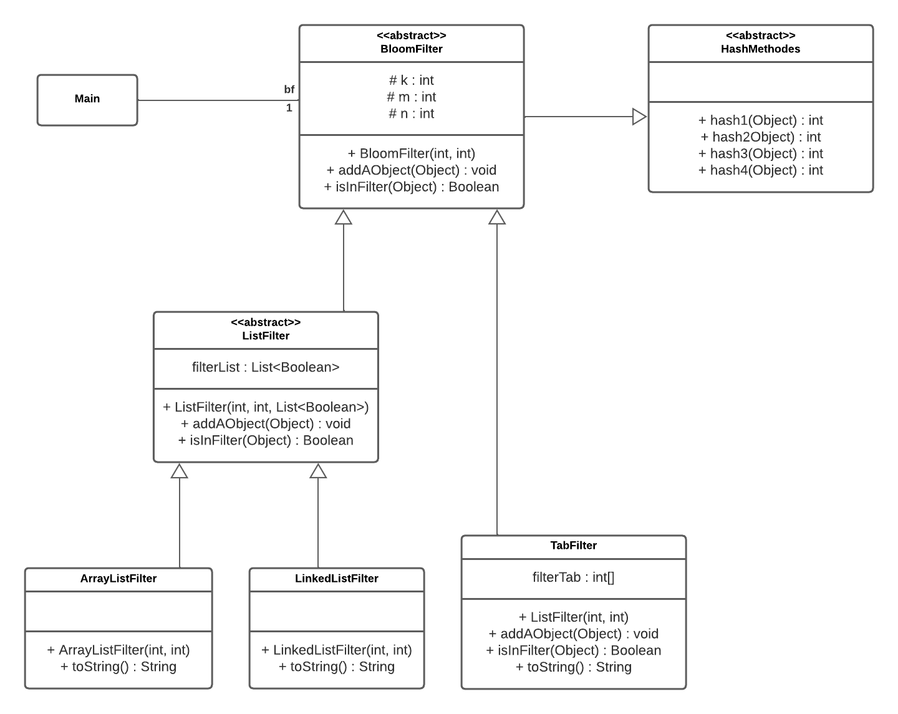

Genetet Maud S3B

# SAE : BloomFilter

# Sumarry


* 1 [Objective](#1)
* 2 [Principle](#2)
  * 2.1 [Definition](#2.1)
  * 2.2 [How it's work ?](#2.2)
  * 2.3 [Advantages](#2.3)
  * 2.4 [Problems](#2.4)
* 3 [Implementation](#3)
    * 3.1 [UML](#3.1)
* 4 [Hashcode Methode](#4)
* 5 [Benchmark](#5)
  * 5.1 [Time Test](#5.1)
  * 5.2 [M Based Error Test](#5.2)
  * 5.3 [K Based Error Test](#5.3)
  * 5.4 [Error Test](#5.4)
* 6 [Conclusion](#6)


<h1 id="1">1. Objective</h1>

The objective of this project is to implement a Bloom Filter with Netbeans.<br>To test it with different parameters the best choice for the number of hash functions and the size of the table to have the minimal errors. 
<br>And also find the minimal time we can have to search a object in the Bloom Filter.

<h1 id="2">2. Principle</h1>

<h2 id="2.1">2.1 Definition</h2>

 The principle of a Bloom Filter is to know if a elements is in a list or not the most faster possible. 
 <br>But the Bloom Filter have a problem, it can have false positive, it means that the Bloom Filter can say that an element is in the list but it is not but the contrary is impossible.

<h2 id="2.2">2.2 How it's work ?</h2>

 The Bloom Filter work with a list of bits ( here it's a list of boolean ), the list is initialized with ``false`` value. When we want to add a object, we take the hashcode of this object and use this number like a index in the list and we put the value this index to ``true``.
 So when we want to know if an object is in the list, we take his hashcode and we check if the value at the index of the hashcode is a ``true``.
 <br>If it's a ``true`` value, the object is maybe in the list but if it's a ``false`` value, the object is defitely not in the list. 

<h2 id="2.3">2.3 Advantages</h2>
    
The advantage of the Bloom Filter is that it's very fast to know if an object is not in the list.
<br>And we don't have false negative.

<h2 id="2.4">2.4 Problems</h2>

The problem of the Bloom Filter is that we can have false positive, because many objects can have the same hashcode or the length of the list can be is to small so we can have lot of collisions.

* For example if we have a list of boolean of lenght 10 but we have 100 objects to add, this sure that we will have a lot of collisions. Because it's praticly sure that the list of boolean will be full of ``true`` value.

<h1 id="3">3. Implementation</h1>

The implementation of the Bloom Filter is very simple, we have a list of boolean and a number of hash functions.
To this SAE, it's demande to use 3 type of structure to implement ``list of boolean`` of the Bloom Filter :
* ``boolean[]``
* ArrayList
* LinkedList

<h2 id="3.1">3.1 UML</h2>

This is the UML of my Bloom Filter :



<h1 id="4">4. Hascode Methode</h1>

I chose to make simple hashcode methode, my hascode methode are maybe not all very efficient but it's work with all the object and not only ``Integer``

* Here is the list of my hashcode methode :

```java
    public int hash1(Object o){
        return abs(o.hashCode()*1989679617%95647853);
    }
    
    public int hash2(Object o){
        return abs(o.toString().hashCode());
    }
    
    public int hash3(Object o){
        return abs(o.toString().length()*5756*o.hashCode());
    }
    
    public int hash4(Object o){
        int hash = 15697;
        String s = o.toString();
        for (int i = 0; i<s.length(); i++) {
            hash *= s.charAt(i);
        }
        return abs(hash*427);
    }    
```


<h1 id="5">5. Benchmark</h1>
<h2 id="5.1">5.1. Time Test</h2>
<h2 id="5.2">5.2. M Based Error Test</h2>
<h2 id="5.3">5.3. K Based Error Test</h2>
<h2 id="5.4">5.4. Error Test</h2>
<h1 id="6">6. Conclusion</h1>
